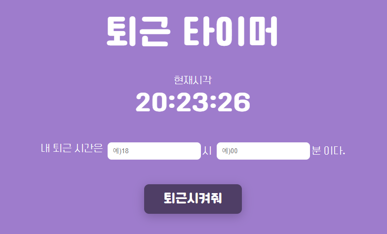

# time-to-go-home (퇴근타이머)

## 기능
- 퇴근 시각을 입력하고 버튼을 누르면 현재 시각으로부터 남은 시간을 알려줍니다. (24시간 기준)
- 현재 시각 이전의 시각은 입력하면 경고 메세지창을 반환합니다.
- 공유하기 버튼을 누르면 남은 시간이 클립보드에 복사 됩니다.
- 닫기 버튼을 누르거나 배경을 누르면 창이 닫히고 페이지가 새로고침 됩니다.
